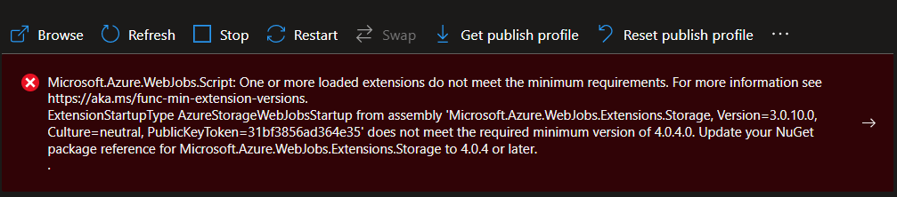

# Upgrading Azure Function from V3 to V4

Microsoft announced the 3 December 2022 as the deadline for migrating Azure functions from V3 to V4.

Migrating an existig function from V3 (.Net Core 3.1) to V4 (.Net Core 6) requires 3 macro steps:
 - upgrade VS project
 - upgrade Azure Function App configuration
 - redeploy the Function
<br/>
<br/>

### 1 - Upgrade the Visual Studio project from .net 3.1 to .net 6

- check breaking changes betweenn V3 and V4
- upgrade .net version
```xml
OLD:
  <PropertyGroup>
    <TargetFramework>netcoreapp3.1</TargetFramework>
    <AzureFunctionsVersion>v3</AzureFunctionsVersion>
  </PropertyGroup>
NEW: 
  <PropertyGroup>
    <TargetFramework>net6.0</TargetFramework>
    <AzureFunctionsVersion>v4</AzureFunctionsVersion>
  </PropertyGroup>
```

 - upgrade Nuget packages (carefully)

```xml
OLD:
 <PackageReference Include="Microsoft.NET.Sdk.Functions" Version="3.0.13" />
NEW:
 <PackageReference Include="Microsoft.NET.Sdk.Functions" Version="4.1.1" />
```
<br/>
<br/>

### 2 - Upgrade the running version of the function on Azure from V3 to V4
Using Cloud Shell CLI:

```shell
##show current app-settings
az functionapp config appsettings list --name functName --resource-group functResGroup --output table

##show current configuration
az functionapp config show  --name functName --resource-group functResGroup 

##migration to V4
az functionapp config appsettings set --settings FUNCTIONS_EXTENSION_VERSION=~4 --name functName --resource-group functResGroup

## set correct .net core version
az functionapp config set --net-framework-version v6.0 --name functName --resource-group functResGroup

## restart the function
```

Notes:
 - consider stopping the function during the upgrade
 - running .Net 3.1 function on V4, without upgrading to .Net 6, generates a warning on Azure portal --> Function --> Function runtime settins: "Your app is pinned to an unsupported runtime version fro 'dotnet'. For better performance we reccomend using one of our supported versions instead: ~3."
<br/>
<br/>


### 3 - Redeploy the function 
Compile and deploy the function running on .Net 6
<br/> 
<br/>


## Notes


 - After upgrading to V4, if the running function is using old extensions, you could get an error like the following. In such a case, the app function does not start. To solve, upgrade the old referenced extensions and redeploy.  https://aka.ms/func-min-extension-versions  
  



<br/> 
<br/>


# References

[Breaking changes between 3.x and 4.x](https://docs.microsoft.com/en-us/azure/azure-functions/functions-versions?tabs=azure-cli%2Cin-process%2Cv4&pivots=programming-language-csharp#breaking-changes-between-3x-and-4x)

[Migrate from ASP.NET Core 3.1 to 6.0](https://docs.microsoft.com/en-us/aspnet/core/migration/31-to-60?view=aspnetcore-6.0&tabs=visual-studio)

[How to target Azure Functions runtime versions](https://docs.microsoft.com/en-us/azure/azure-functions/set-runtime-version)

[Issues you may meet when upgrading Azure function app to V4](https://techcommunity.microsoft.com/t5/apps-on-azure-blog/issues-you-may-meet-when-upgrading-azure-function-app-to-v4/ba-p/3288983)

[Azure Functions runtime versions overview](https://docs.microsoft.com/en-us/azure/azure-functions/functions-versions)

[Azure Functions runtime versions overview / Migrating from 3.x to 4.x](https://docs.microsoft.com/en-us/azure/azure-functions/functions-versions?tabs=azure-cli%2Cin-process%2Cv4&pivots=programming-language-csharp#migrating-from-3x-to-4x)

 
