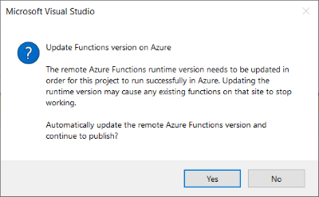
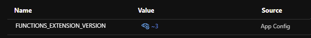
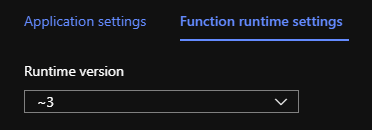

# Azure Functions - misc
<br/>

## FunctionsStartup 
Steps:
 - Add reference to:
   - Microsoft.Azure.Functions.Extensions
   - Microsoft.NET.Sdk.Functions  >= 1.0.28
 - Create a Startup class, extending FunctionsStartup and overriding Configure method
 - Mark the assembly with FunctionsStartup attribute

```csharp
using Microsoft.Azure.Functions.Extensions.DependencyInjection;

[assembly: FunctionsStartup(typeof(BasicFunctions.Startup))]

namespace BasicFunctions
{
    public class Startup : FunctionsStartup
    {
        public override void Configure(IFunctionsHostBuilder builder)
        {
            // code...
        }
    }
}
```

Details: https://docs.microsoft.com/en-us/azure/azure-functions/functions-dotnet-dependency-injection


## Upgrade from V2 to V3

In Visual Studio, update version and references inside project file.

From:
```xml
<Project Sdk="Microsoft.NET.Sdk">
  <PropertyGroup>
    <TargetFramework>netcoreapp2.1</TargetFramework>
    <AzureFunctionsVersion>v2</AzureFunctionsVersion>
  </PropertyGroup>
  <ItemGroup>
    <PackageReference Include="Microsoft.NET.Sdk.Functions" Version="1.0.38" />
  </ItemGroup>
```

To:
```xml
<Project Sdk="Microsoft.NET.Sdk">
  <PropertyGroup>
    <TargetFramework>netcoreapp3.1</TargetFramework>
    <AzureFunctionsVersion>v3</AzureFunctionsVersion>
  </PropertyGroup>
  <ItemGroup>
    <PackageReference Include="Microsoft.NET.Sdk.Functions" Version="3.0.11" />
  </ItemGroup>
```
<br/>

When you deploy from Visual Studio, a warning appears. Click "yes".  


Verify that FUNCTIONS_EXTENSION_VERSIONS is correctly set.  


Verify that current runtime version is V3:  



## CORS
In local.settings.json
```json
  "Host": {
    "CORS": "*"
  }
```


## Disable a function

Add a configuration key in the format
```
"AzureWebJobs.[function_name].Disabled": "true"
```
It works both in local.settings.json (visual studio) and on Azure.  
Ref: https://docs.microsoft.com/en-us/azure/azure-functions/disable-function


## Locked dll files during deploy
In configuration, add key MSDEPLOY_RENAME_LOCKED_FILES = 1


## Application Insights custom data (CustomMetrics)
Azure Functions automatically sends data to Application Insights if APPINSIGHTS_INSTRUMENTATIONKEY is present.
To manually use TelemetryClient from code, e.g. for sending custom Trace or Metric, it's required to add a reference to App Insight Nuget packages.  
Do not add "low-level" packages directly but, instead, add only Microsoft.Azure.WebJobs.Logging.ApplicationInsights It will bring all required packages in a compatible way to the hosting environment. More details here: https://github.com/MicrosoftDocs/azure-docs/issues/35181#issuecomment-512288993  
If Nuget packages are not compatible **OR** the key APPINSIGHTS_INSTRUMENTATIONKEY is missing, you'll get errors like:  
``` 
Microsoft.Extensions.DependencyInjection.Abstractions: Unable to resolve service  
for type 'Microsoft.ApplicationInsights.Extensibility.TelemetryConfiguration'   
while attempting to activate 'BasicFunctions.CustomMetrics'
``` 
More information about App Insights in Functions:
 - https://docs.microsoft.com/en-us/azure/azure-monitor/app/azure-functions-supported-features  (a bit outdated)  
 - https://docs.microsoft.com/en-us/azure/azure-functions/functions-monitoring#log-custom-telemetry-in-c-functions    
 
**Note:** functions must be declared as not static and a constructor is required to get the pre-configured TelemetryClient.


## Hosting
https://github.com/Azure/azure-functions-host/

