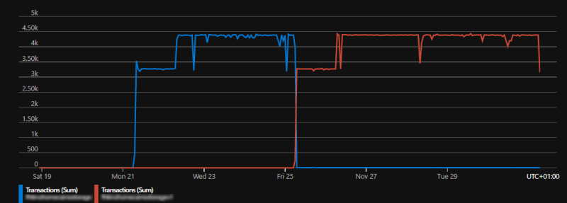
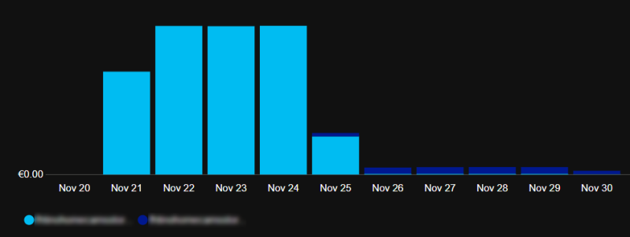

# Storage Accounts 

## Diagnostic settings

Activating Diagnostic Settings on a storage account, it is possible to trace every single API call targeting the account. If you choose to send logging data to a storage account, a json log file is created. It contains much information: source ip, request and response size, user-agent, etc. [1] Among them, the hash of authentication "token" used. If the authentication method was the storage account key, it is exactly the SHA256 of the key used. This piece of C# generated the same hash starting from a key as a string, exactly the one you see and copy/paste from the Azure Portal.
  
```C#
string key = "abcd...==";
Console.WriteLine(Convert.ToHexString(SHA256.Create().ComputeHash(Convert.FromBase64String(key))));
```
   

[1] https://docs.microsoft.com/en-us/azure/storage/tables/monitor-table-storage-reference#resource-logs


## Prices

Carefully consider the different prices of storage account V1 and V2. If you don't need V2, consider using V1. In particular when you have many transactions.  Example below: same application, same number of transactions per day, storage changed from V2 to V1.
  

  



