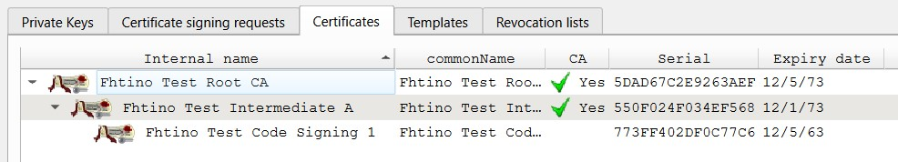
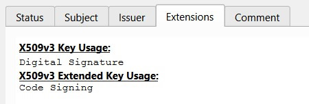
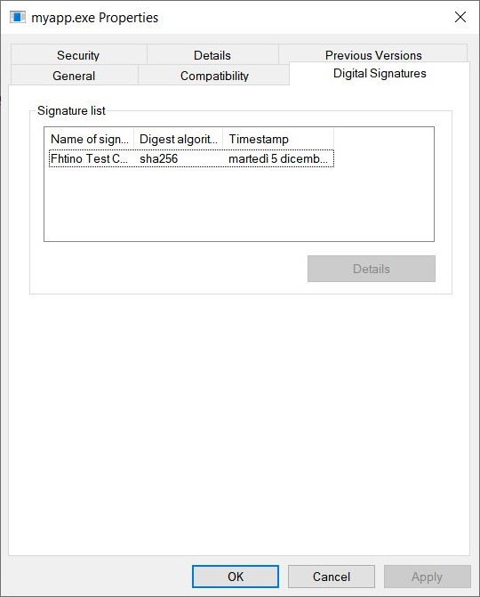
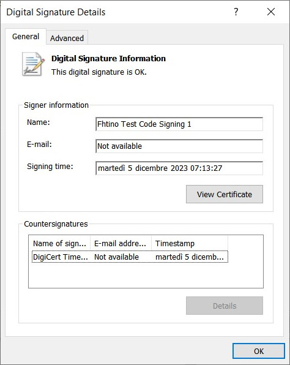
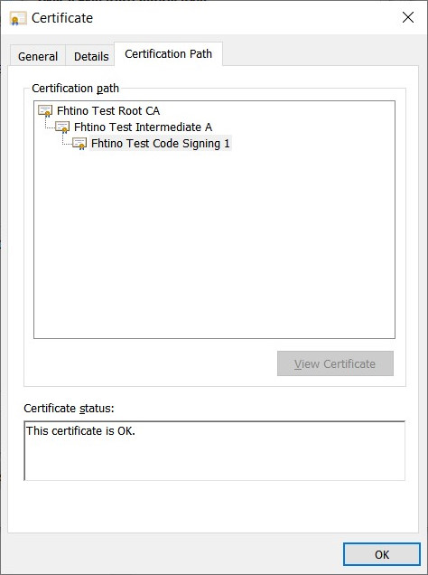
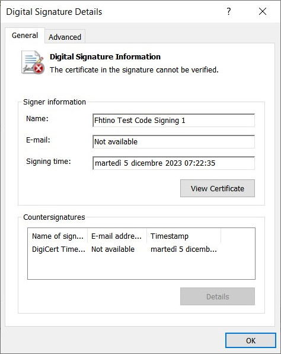
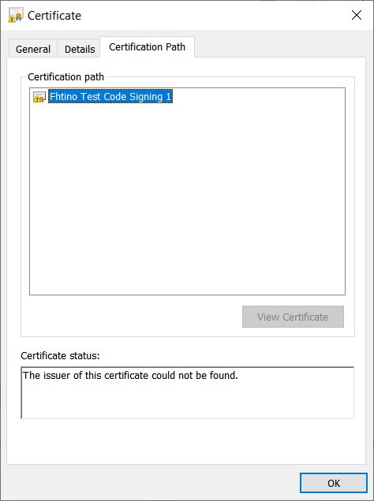

# Code signing with SignTool.exe

*Notes about creating a test CA and signing an exe file*

SignTool.exe is available as part of the Windows SDK and normally installed by Visual Studio. Run "Developer Command Prompt for VS 2022" and it will be available at the command line.

Usage:
```
signtool.exe  sign  /f signing_cert.pfx /p test /td sha256 /fd sha256 /tr http://timestamp.digicert.com  myapp.exe
```

Notes:
 - if you play with a local / testing certification authority under your control, remember to:
   - install the CA root certificate among the computer trusted root certificates
   - the code signing certificate must be created with "Code Signing" X509v3 extended extention key active
 - if your code signing certificate has been signed by an intermediate CA (this should be the normal situation), use a pfx/p12 file containing all the intermediate certificates. Otherwise the signature cannot be verifies because of the lack of inermediate certificates inside the exe. 
 - you can run signtool against the same exe multiple times. If a previous digital signature is present, it will be replaced by the new one. Use /as to not remove old signatures.
 - for your experiments, create an exe with Visual Studio or take one from your hard-disk, e.g. notepad.exe  **Copy it! Do not play with the original one!**
  
<br/>

### XCA testing CA

<table>
	<tr>
		<td></td>
		<td></td>		
	</tr>
</table>

 
### Exe correctly signed
 
<table>
	<tr>
		<td></td>
		<td></td>
		<td></td>
	</tr>
</table>


### Exe signed without full chain
 
<table>
	<tr>
		<td></td>
		<td></td>
		<td></td>
	</tr>
</table>

 
### Tools

| | |
| -- | -- |
| SignTool.exe | https://learn.microsoft.com/en-us/windows/win32/seccrypto/signtool |
| XCA | https://hohnstaedt.de/xca/ |


